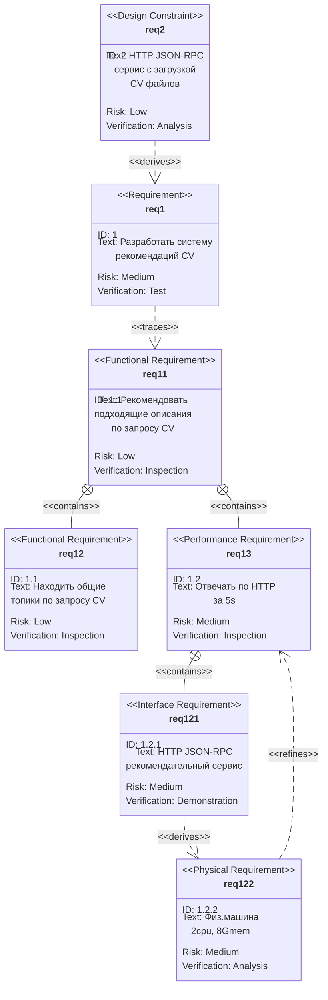
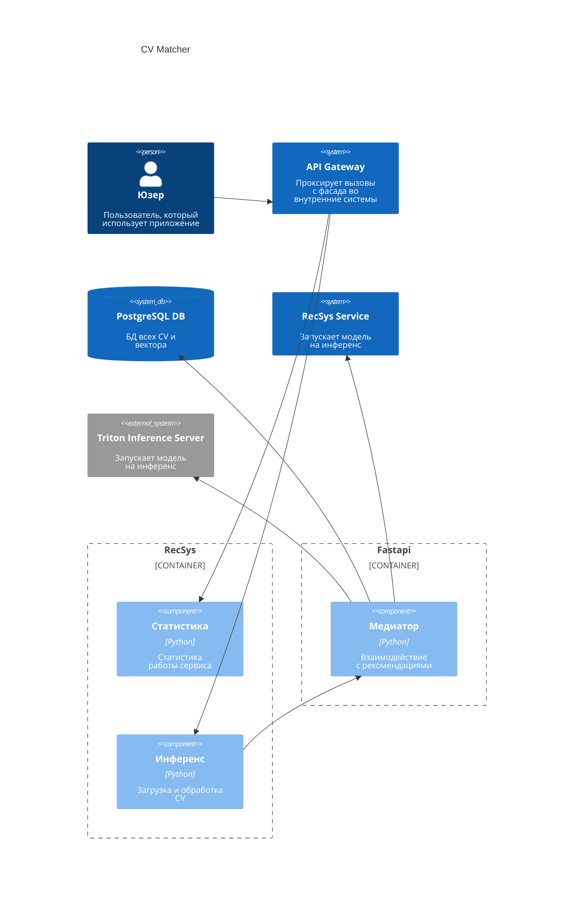

# CV Matcher

## Требования к продукту

Рассмотрим требования на диаграме SysML REQ



## Системный дизайн

Рассмотрим системный дизайн на архитектурных диаграммах C4 Model:


## Формулировка в ML терминах

Сначала мы составляем список самых популярных слов, используемых во всех CV, что дает представление об основном словаре исходных данных. Стоп-слова здесь опущены, чтобы избежать каких-либо тривиальных союзов, предлогов и пр.


Затем генерируем гистограмму размерности слов в заголовках и используем теги, чтобы понять типы слов, используемых в корпусе.

Далее применить алгоритм кластеризации к корпусу заголовков, чтобы изучить CV, а также то, как темы менялись с течением времени. Для этого сначала нужно поэксперементировать с небольшим сабсетом чтобы определить какой из двух потенциальных алгоритмов кластеризации является наиболее подходящим. Как только это будет установлено, можно масштабировать результат на все данные.

### Предварительная обработка

Единственный шаг предварительной обработки, необходимый в нашем случае, — это построение признаков, когда мы берем образцы текстов и представляем их в некотором удобном пространстве признаков. На практике это просто означает преобразование каждой строки в некий числовой вектор. Это можно сделать с помощью объекта CountVectorizer из SKLearn, который возвращает n×K матрицу терминов документа, где K -- количество различных слов в n заголовках, меньше стоп-слов и с ограничением _max_features_.

Есть обучающая выборка и теперь возможно фактически реализовать алгоритм кластеризации. 

Выбором будет LDA / LSA. Оба могут принять матрицу терминов документа в качестве входных данных и дадут результат n×N матрицу тем в качестве вывода,
где N -- количество тем, которым можно управлять.

### LDA

В качестве эксперимента был выбран подбор оптимальной модели для мэтчинга вакансий с резюме. 

Эксперимент был проведен с целью определения оптимального количества тем для модели Latent Dirichlet Allocation (LDA) в задаче тематического моделирования текстов. Использовалась выборка в 50% случайно выбранных от исходного объема текстовых данных, обработанных с применением NLP техник, таких как лемматизация и исключение стоп-слов. Для оценки качества моделей на разном количестве тем была применена метрика когерентности. В ходе эксперимента был построен график зависимости когерентности от количества тем в модели. 

Анализ графика позволяет сделать вывод, что наилучшая когерентность наблюдается при небольшом количестве тем (около 10-20), после чего кривая стабилизируется с небольшими колебаниями. Это указывает на то, что для данного набора данных введение большего количества тем не приводит к значительному улучшению интерпретируемости модели. Следовательно, для последующего анализа данных и интерпретации результатов целесообразно использовать модель с числом тем в данном диапазоне.


Пример визуализации [тут](https://www.kaggle.com/code/solution/lda-visualization).

Лог эксперимента:
```
Topic 0: 0.028*"проект" + 0.020*"разработка" + 0.019*"данные" + 0.019*"знание" + 0.019*"анализ" + 0.014*"участие" + 0.013*"управление" + 0.012*"система" + 0.012*"задача" + 0.012*"процесс"

Topic 1: 0.049*"клиент" + 0.044*"продажа" + 0.025*"менеджер" + 0.016*"рынок" + 0.016*"развитие" + 0.015*"офис" + 0.013*"отдел" + 0.012*"руководитель" + 0.011*"услуга" + 0.011*"поиск"

Topic 2: 0.019*"объект" + 0.018*"технический" + 0.018*"производство" + 0.018*"оборудование" + 0.016*"документация" + 0.014*"знание" + 0.013*"материал" + 0.013*"контроль" + 0.011*"организация" + 0.010*"проведение"

Topic 3: 0.070*"and" + 0.037*"the" + 0.036*"of" + 0.035*"to" + 0.026*"in" + 0.022*"a" + 0.020*"with" + 0.013*"for" + 0.012*"experience" + 0.009*"is"

Topic 4: 0.031*"вакансия" + 0.019*"сайт" + 0.015*"рекламный" + 0.014*"создание" + 0.014*"проект" + 0.013*"умение" + 0.012*"твой" + 0.011*"материал" + 0.010*"текст" + 0.010*"маркетинг"

Topic 5: 0.029*"условие" + 0.027*"обязанность" + 0.023*"rur" + 0.020*"оформление" + 0.016*"quot" + 0.014*"тк" + 0.014*"заработный_плата" + 0.012*"рф" + 0.012*"рабочий" + 0.012*"товар"

Topic 6: 0.066*"ваш" + 0.031*"белый" + 0.026*"внимательность" + 0.025*"ребёнок" + 0.022*"отличный" + 0.021*"автомобиль" + 0.020*"час" + 0.020*"занятость" + 0.016*"полный" + 0.015*"школа"

Topic 7: 0.043*"разработка" + 0.028*"знание" + 0.020*"приложение" + 0.019*"разработчик" + 0.016*"python" + 0.015*"команда" + 0.015*"проект" + 0.014*"понимание" + 0.013*"тестирование" + 0.012*"система"

Topic 8: 0.135*"true" + 0.046*"система" + 0.023*"технический" + 0.021*"поддержка" + 0.021*"знание" + 0.018*"администрирование" + 0.018*"настройка" + 0.016*"оборудование" + 0.014*"сетевой" + 0.014*"информационный"

Topic 9: 0.063*"br" + 0.022*"наш" + 0.020*"работать" + 0.016*"команда" + 0.013*"который" + 0.013*"em" + 0.012*"свой" + 0.009*"возможность" + 0.008*"это" + 0.008*"человек"

```


## Использование

Чтобы запустить наш сервис необходимо использовать команды:
```sh
git clone [https://github.com/BekusovMikhail/number_plate.git](https://github.com/gevaland/dlp.git)
cd dlp/CV_matcher
docker compose build
docker compose up --wait

http://127.0.0.1:8501/
```
**Если у вас появляются подобные предупреждения**  
  
**Запустите команду ``docker compose up --wait`` еще раз**

Нужно скачать папку [triton_model_repo](https://drive.google.com/drive/folders/1zUPhzSTosEZQAJinMLVhcKhjrkHA7FRB?usp=sharing) и перенести ее в **...dlp/CV_matcher/**

## Документация

Документация доступна по url  
```http://127.0.0.1:8600/docs```
