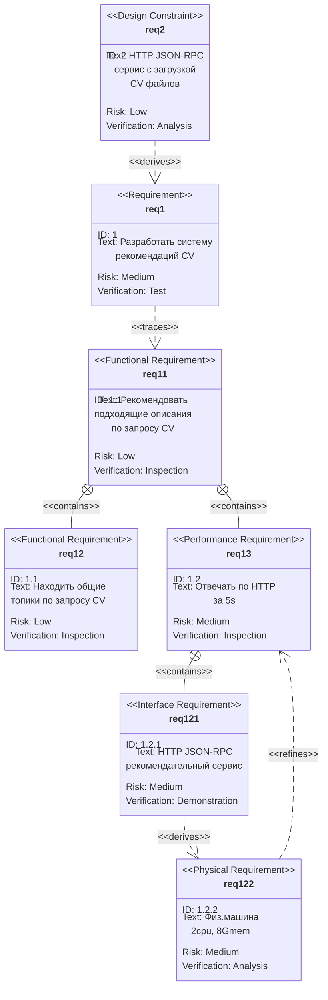
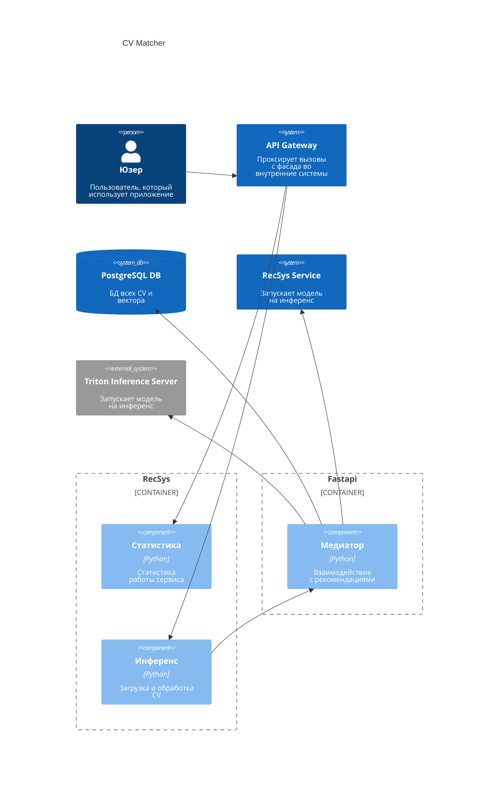

# CV Matcher

## Требования к продукту

Рассмотрим требования на диаграме SysML REQ



## Системный дизайн

Рассмотрим системный дизайн на архитектурных диаграммах C4 Model:


## Формулировка в ML терминах

Сначала мы составляем список самых популярных слов, используемых во всех CV, что дает представление об основном словаре исходных данных. Стоп-слова здесь опущены, чтобы избежать каких-либо тривиальных союзов, предлогов и пр.

_гистограмма Кости_

Затем генерируем гистограмму размерности слов в заголовках и используем теги, чтобы понять типы слов, используемых в корпусе.

Далее применить алгоритм кластеризации к корпусу заголовков, чтобы изучить CV, а также то, как темы менялись с течением времени. Для этого сначала нужно поэксперементировать с небольшим сабсетом чтобы определить какой из двух потенциальных алгоритмов кластеризации является наиболее подходящим. Как только это будет установлено, можно масштабировать результат на все данные.

### Предварительная обработка

Единственный шаг предварительной обработки, необходимый в нашем случае, — это построение признаков, когда мы берем образцы текстов и представляем их в некотором удобном пространстве признаков. На практике это просто означает преобразование каждой строки в некий числовой вектор. Это можно сделать с помощью объекта CountVectorizer из SKLearn, который возвращает n×K матрицу терминов документа, где K -- количество различных слов в n заголовках, меньше стоп-слов и с ограничением _max_features_.

Есть обучающая выборка и теперь возможно фактически реализовать алгоритм кластеризации. 

Выбором будет LDA / LSA. Оба могут принять матрицу терминов документа в качестве входных данных и дадут результат n×N матрицу тем в качестве вывода,
где N -- количество тем, которым можно управлять.

### LDA

Пример визуализации [тут](https://www.kaggle.com/code/solution/lda-visualization).


## Использование

Чтобы запустить наш сервис необходимо использовать команды:
```sh
git clone [https://github.com/BekusovMikhail/number_plate.git](https://github.com/gevaland/dlp.git)
cd dlp/CV_matcher
docker compose build
docker compose up --wait

http://127.0.0.1:8501/
```
**Если у вас появляются подобные предупреждения**  
  
**Запустите команду ``docker compose up --wait`` еще раз**

Нужно скачать папку [triton_model_repo](https://drive.google.com/drive/folders/1zUPhzSTosEZQAJinMLVhcKhjrkHA7FRB?usp=sharing) и перенести ее в **...dlp/CV_matcher/**

## Документация

Документация доступна по url  
```http://127.0.0.1:8600/docs```
