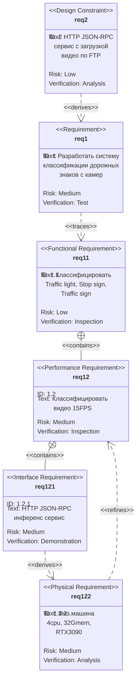

# Deep Learning in Practice

```mermaid
    requirementDiagram

    requirement req1 {
    id: 1
    text: "Разработать систему
            классификации дорожных
            знаков с камер"
    risk: medium
    verifymethod: test
    }

    designConstraint req2 {
    id: 2
    text: "HTTP JSON-RPC
            сервис с загрузкой
            видео по FTP"
    risk: low
    verifymethod: analysis
    }

    functionalRequirement req11 {
    id: 1.1
    text: "Классифицировать
            Traffic light, Stop sign,
            Traffic sign"
    risk: low
    verifymethod: inspection
    }

    performanceRequirement req12 {
    id: 1.2
    text: "Классифицировать
            видео 15FPS"
    risk: medium
    verifymethod: inspection
    }

    interfaceRequirement req121 {
    id: 1.2.1
    text: "HTTP JSON-RPC
            инференс сервис"
    risk: medium
    verifymethod: demonstration
    }

    physicalRequirement req122 {
    id: 1.2.2
    text: "Физ.машина
            4cpu, 32Gmem,
            RTX3090"
    risk: medium
    verifymethod: analysis
    }

    req1 - traces -> req11
    req2 - derives -> req1
    req11 - contains -> req12
    req12 - contains -> req121
    req121 - derives -> req122
    req122 - refines -> req12
```
