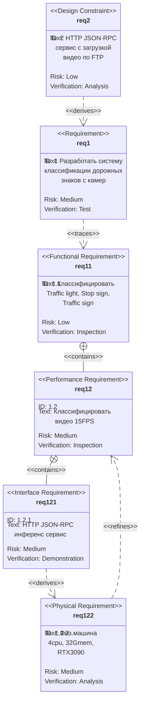
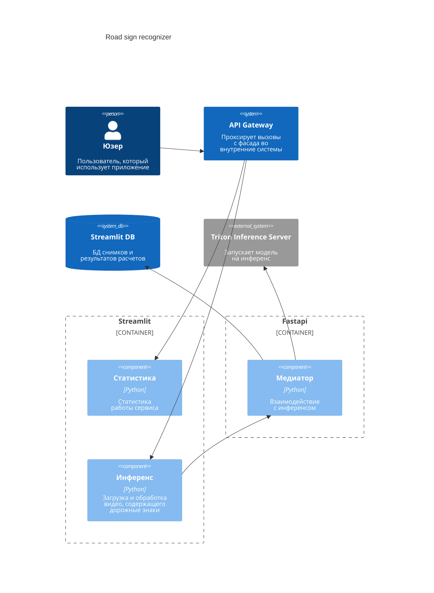

# Deep Learning in Practice
# Road Sign Recognition

## Требования к продукту

Рассмотрим требования на диаграме SysML REQ



## Системный дизайн

Рассмотрим системный дизайн на архитектурных диаграммах C4 Model:


## Формулировка в ML терминах

### Метрики


### Датасеты и классы

* https://www.kaggle.com/datasets/andrewmvd/road-sign-detection
  * 877 картинок в 4 классах Trafic Light, Stop, Speedlimit, Crosswalk
  * разметка в формате class xmin xmax ymin ymax
  * знаки русские

* https://www.kaggle.com/datasets/valentynsichkar/traffic-signs-dataset-in-yolo-format
  * 741 картинок в 4 классах, разметка Class Number, center in x, center in y, Width Height
  * знаки американские

* https://www.kaggle.com/datasets/barzansaeedpour/traffic-sign-detection?select=classes.txt
  * 703 картинки, штук 30 классов, разметка в формате class xmin xmax ymin ymax
 
### Результаты сравнения моделей


## Использование

Чтобы запустить наш сервис необходимо выполнить в командной строке:
```sh
git clone https://github.com/gevaland/dlp.git
cd dlp/road_sign_recognizer
docker compose build
docker compose up
```

Не забыть скачать директорию `triton_model_repo` [тут](https://drive.google.com/drive/folders/1uRjhYgJrJFe5PR-Bww4Md0Li7XiSg3ta) и перенести ее в `.../dlp/road_sign_recognizer`

Можно использовать сервис по адресу [тут](http://127.0.0.1:8501/)

## Документация

Документация доступна [тут](http://127.0.0.1:8600/docs)

Видео с демонстрацией работы доступно [тут](https://drive.google.com/file/d/1XgUxX31-SLS5zWhKsPzVJcYSZi00_Zcu/view?usp=drive_link)
